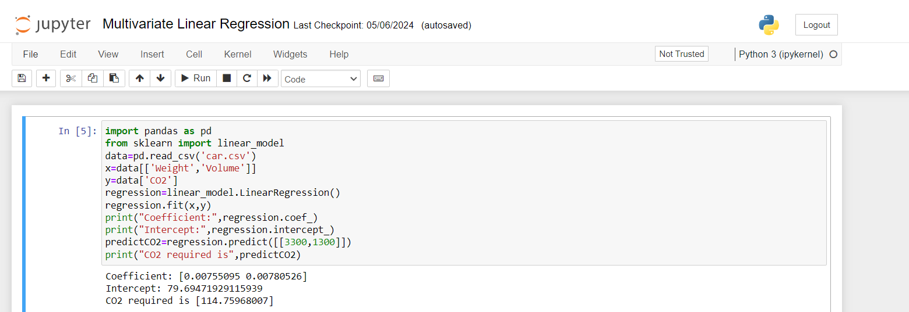

# Implementation of Multivariate Linear Regression
## Aim
To write a python program to implement multivariate linear regression and predict the output.
## Equipment’s required:
1.	Hardware – PCs
2.	Anaconda – Python 3.7 Installation / Moodle-Code Runner
## Algorithm:
### Step1
Import pandas ,sklearn.linear_model modules and create the corresponding objects.
### Step2
Read the given csv file using read_csv() method of pandas.
### Step3
Get the values of X and Y from readed csv.
### Step4
Create the Linear Regression model and fit the X and Y values.
### Step5
Predict the CO2 emission of a car where the Weight is 3300 kg and the Volume is 1300 cm³.
### Step6
Display the predicted output and end the program.
## Program:
```
Developed by: Karan A
Register Number: 212223230099
```
```py
import pandas as pd
from sklearn import linear_model
data=pd.read_csv('car.csv')
x=data[['Weight','Volume']]
y=data['CO2']
regression=linear_model.LinearRegression()
regression.fit(x,y)
print("Coefficient:",regression.coef_)
print("Intercept:",regression.intercept_)
predictCO2=regression.predict([[3300,1300]])
print("CO2 required is",predictCO2)
```
## Output:



<br>

## Result
Thus the multivariate linear regression is implemented and predicted the output using python program.